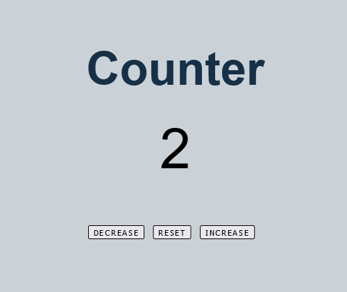

# Counter App using JavaScript/jQuery

 

## Table of contents

- [Overview](#overview)
  - [The challenge](#the-challenge)
  - [Screenshot](#screenshot)
  - [Links](#links)
- [My process](#my-process)
  - [Built with](#built-with)
  - [What I learned](#what-i-learned)
 
- [Author](#author)

## Overview

### The challenge

Users should be able to:

- Click the button to increase, decrease, or reset the number.

### Screenshot

### Links

- Live Site URL: [https://snellc1.github.io/Counter/](https://snellc1.github.io/Counter/)

## My process

### Built with

- Semantic HTML5 markup
- CSS custom properties
- JavaScript
- jQuery
- Responsive

### What I learned

Using jQuery to use the click function as change HTML.

## Author

- Website - [Christopher Snell](https://www.your-site.com)

